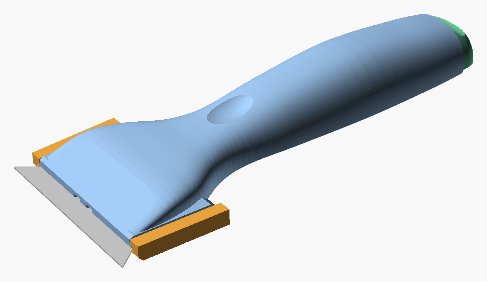
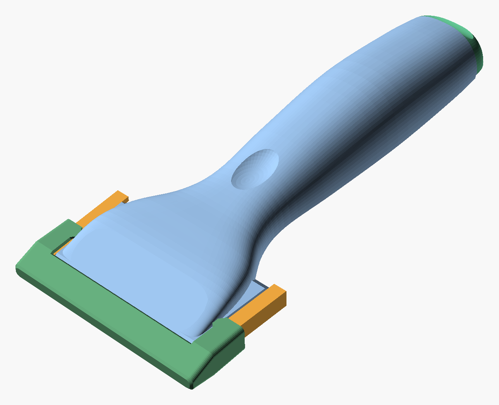
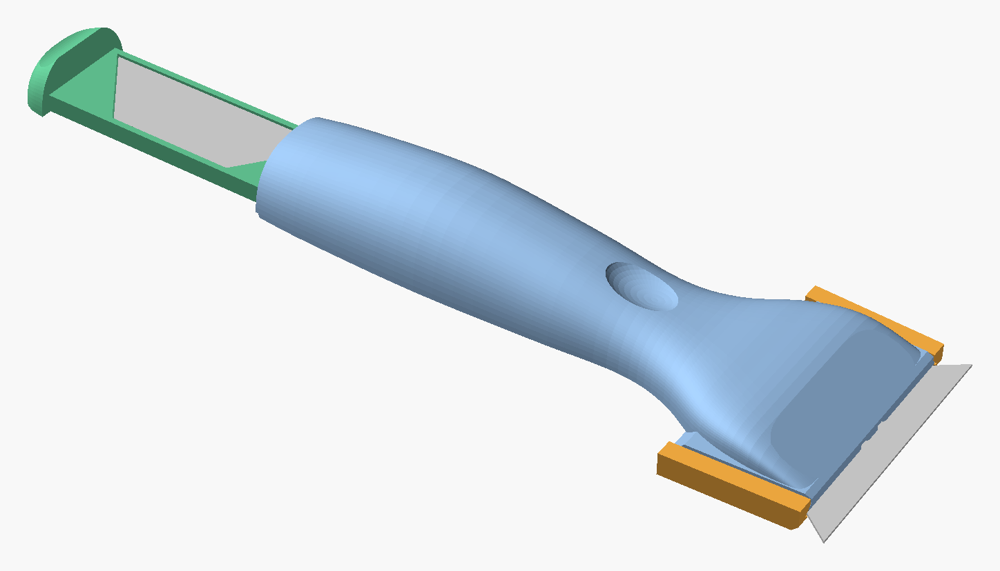
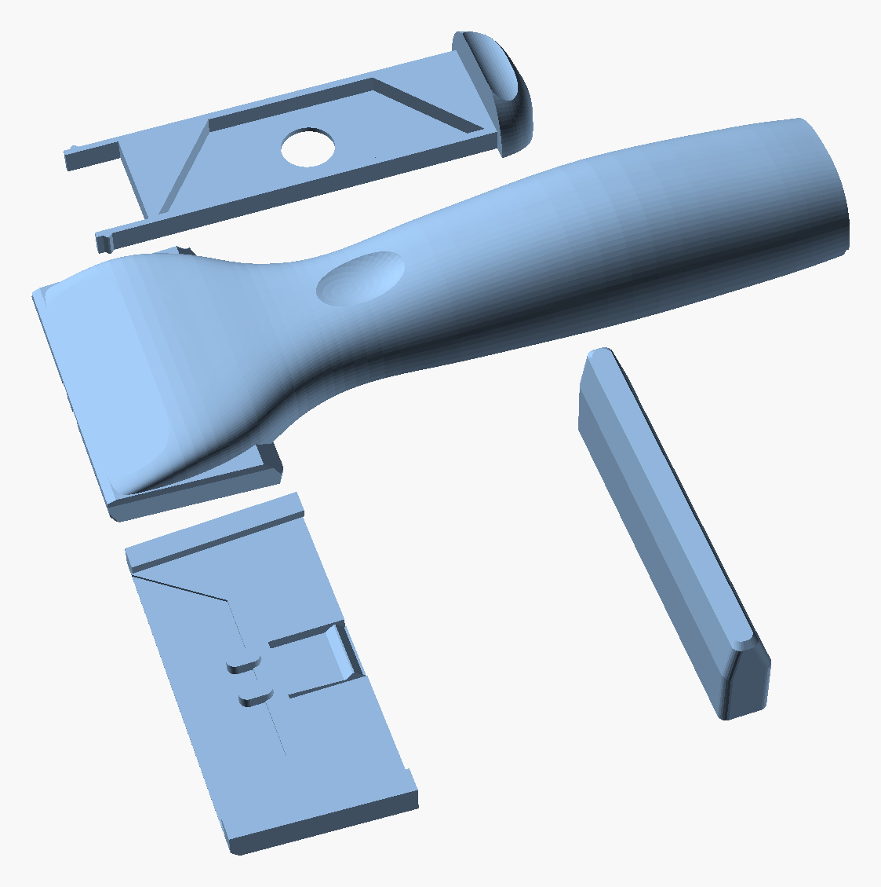

<!-- Keep this README in step with the releases: see "Updating this README" at the bottom. -->

# Blade scraper

A 3D-printed razor scraper for standard trapezoid utility blades (61 mm cutting edge). Use it on glass, tiles, labels and paint. It has four PLA parts and needs no screws, other hardware or supports.

**Current version: v6** · [download the latest release](https://github.com/vdesselwout/blade-scraper/releases/latest) · v6 is waiting for its test print

| Guard on | Spare-blade drawer open |
|---|---|
|  |  |

## Features

- **No-tool blade change:** the blade sits on two pegs that go through its notches. The cap slides onto the head on dovetails and clamps the blade, and a small snap stops it creeping forward.
- **Spare blades in the handle:** a drawer slides out of the butt and holds 5 blades flat, with their edges enclosed. It clicks shut.
- **Slim guard:** an open-top guard covers the exposed edge and leaves the head visible.
- **Size:** 155.5 mm long, with a 31 × 19 mm palm swell. The full set uses about 38 g of PLA.

## Printing

Each [release](https://github.com/vdesselwout/blade-scraper/releases) has three files:

- `scraper-vN.stl`: all parts laid out on one bed
- `scraper-vN.3mf`: the same layout as a Creality Print project, with print settings included
- `scraper-vN-parts.zip`: each part as its own STL

Print in PLA with a 0.4 mm nozzle, 2 walls and 15% infill. Print every part as laid out; no supports are needed. The guard stands on its nose with its open end up; if it comes loose from the bed, turn on a brim. The only bridges are short ones: the two 3.4 mm peg grooves under the head and the 23 mm roof of the drawer channel in the handle.

## Using it

1. **Fitting a blade:** lay the blade in the cap's pocket with the notches over the pegs and the cutting edge facing forward. Slide the cap backwards onto the head until it clicks.
2. **Removing a blade:** pull the cap firmly forward off the head.
3. **Spare blades:** pull the drawer out of the butt by the groove on its end. Push the stack up through the hole in the tray floor to take the top blade.

## Versions

| Version | What changed |
|---|---|
| [v6](https://github.com/vdesselwout/blade-scraper/releases/tag/v6) | Open-top guard, 8.4 mm tall instead of 13.7 |
| [v5](https://github.com/vdesselwout/blade-scraper/releases/tag/v5) | Shorter, slimmer handle with a spare-blade drawer; head flows into the grip |
| [v4](https://github.com/vdesselwout/blade-scraper/releases/tag/v4) | Tapered dovetails, so fitting the cap no longer drags the blade out |
| [v3](https://github.com/vdesselwout/blade-scraper/releases/tag/v3) | Guard clears the cap's flared first layers |
| [v2](https://github.com/vdesselwout/blade-scraper/releases/tag/v2) | Guard's blade slot runs through to the mouth |
| [v1](https://github.com/vdesselwout/blade-scraper/releases/tag/v1) | First version |

[REVIEW.md](REVIEW.md) has the full log of what changed and why.

## Repository

- `scraper-vN.scad`: the OpenSCAD model of each version. Use a nightly OpenSCAD build; the parts are selected with `part_sel`.
- `drawings/`: a dimensioned drawing and renders for each version
- `prints/`: print files and test-fit pieces for each version
- `concepts/`: design studies that led to v5 and v6
- [BRIEF.md](BRIEF.md): requirements and how the blade is held
- `tools/`: helper scripts (Creality Print project builder, README renders)
